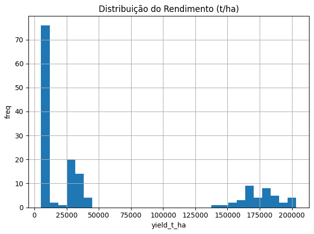
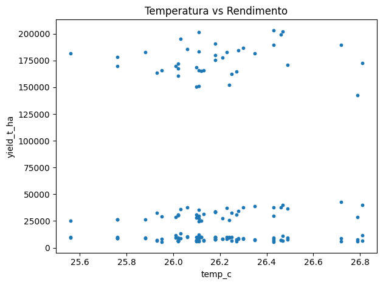
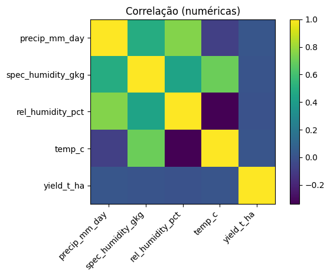
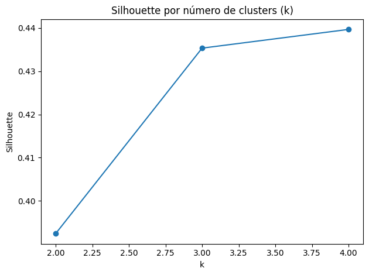
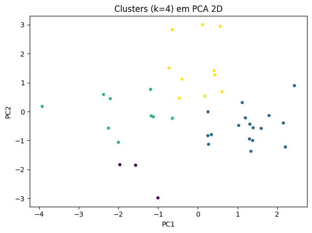
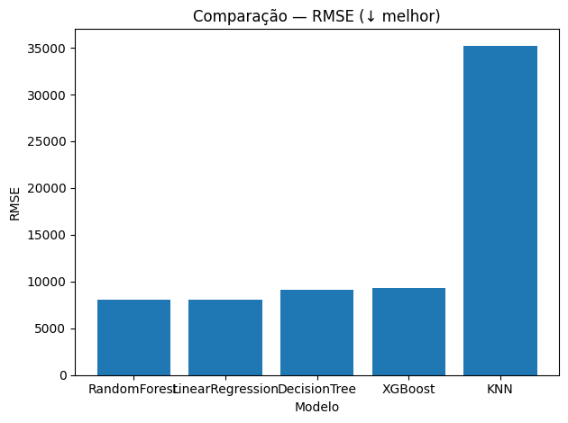
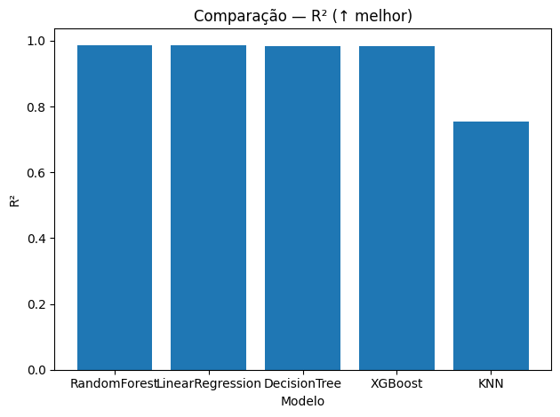

# FIAP - Faculdade de Informática e Administração Paulista 

<p align="center">
<a href= "https://www.fiap.com.br/"></a>
</p>

<br>

#🌱 Cap 1 - FarmTech na era da cloud computing

### ▶️ Vídeo de Evidência do Funcionamento do Projeto.

[https://youtu.be/Wqqj1hWZ_P4](https://youtu.be/Wqqj1hWZ_P4)


## Grupo

## 👨‍🎓 Integrantes: 
| Matrícula                 | Aluno               						  |
|---------------------------|---------------------------------------------|
|        RM 565497          | Vera Maria Chaves de Souza				  | 
|        RM 565286          | Diogo Rebello dos Santos					  |


## 👩‍🏫 Professores:
### Tutor(a) 
- <a href="#">Leonardo Ruiz Orabona</a>
### Coordenador(a)
- <a href="#">André Godoi Chiovato</a>


## 📜 Descrição

Repositório referente ao **PBL Fase 5** da FIAP.  
O projeto aborda **predição de rendimento agrícola** usando Machine Learning e análise de custo de infraestrutura em **AWS**.


## 📁 Estrutura de pastas

```
├── assets/                        # Recursos visuais para documentação
│   ├── logo-fiap.png              # Logo da FIAP para o projeto
│
├── document/              
│   ├── calculadora_aws.pdf        # Calculadora AWS
│   ├── crop_yield.csv             # Base anexada do portal FIAP
│
├── src/                           # Código-fonte principal do projeto
│   │
│   ├── DiogoRebello_rm565286_pbl_fase4.ipynb 
│
├── README.md                      # Documentação principal do projeto

```

## 🚜 Entrega 1 — Machine Learning

### 📊 Dataset
Arquivo: **`crop_yield.csv`**  
Variáveis disponíveis:
- **Crop** → tipo de cultura
- **Precipitação (mm/dia)**
- **Umidade específica (g/kg)**
- **Umidade relativa (%)**
- **Temperatura (°C)**
- **Yield (t/ha)** → rendimento

---

### 🔎 Etapas Realizadas
1. **Análise Exploratória (EDA):**
   - Histograma do rendimento
   - Dispersão de temperatura vs rendimento
   - Correlação entre variáveis numéricas  

     
     
     

2. **Clusterização e Outliers:**
   - KMeans com seleção de *k* via *silhouette*
   - PCA para visualização em 2D
   - IsolationForest para detecção de anomalias  

     
     

3. **Modelagem Supervisionada:**
   Foram comparados **5 algoritmos** de regressão:
   - Regressão Linear
   - Árvore de Decisão
   - KNN (K-Nearest Neighbors)
   - RandomForest
   - XGBoost

   **Métricas usadas:**
   - **MAE (Erro Absoluto Médio)**
   - **RMSE (Raiz do Erro Quadrático Médio)**
   - **R² (Coeficiente de Determinação)**  

     
     

   O **melhor modelo** foi salvo em `artifacts/best_model.joblib`.

---

## ☁️ Entrega 2 — Computação em Nuvem

Foi realizada a simulação de custo para hospedar a API de Machine Learning em **AWS EC2**, considerando:  
- Linux On-Demand (100%)  
- 2 vCPUs  
- 1 GiB RAM  
- 50 GB EBS (HD)  
- Até 5 Gbps de rede  


### 💰 Comparativo de Custos (730h/mês)

| Região            | **Total Mensal** |
|-------------------|-----------------:|
| **us-east-1 (EUA)**  | **US$ 6,88**    |
| **sa-east-1 (Brasil)** | **US$ 11,22**   |


### Link da Estimativa
[https://calculator.aws/#/estimate?id=ce53bf9cd6f5d5c5465fb6329e28c118fa8d0ca0](https://calculator.aws/#/estimate?id=ce53bf9cd6f5d5c5465fb6329e28c118fa8d0ca0)


### 🏁 Justificativa da Escolha
Apesar de **Leste dos EUA (N. da Virgínia) (sa-east-1)** ser mais barata, escolhemos **São Paulo (sa-east-1)** porque:
- Há **restrições legais**: dados de sensores não podem sair do Brasil.  
- Latência mais baixa para dispositivos locais.  
- Maior conformidade com exigências regulatórias.  

---

## ✅ Conclusões
- **Clusters** identificaram perfis de produtividade distintos.  
- **Outliers (~1%)** apontaram possíveis leituras anômalas ou microclimas.  
- O **XGBoost** e a **RandomForest** mostraram melhor desempenho entre os modelos testados.  
- Para produção, a infraestrutura recomendada é **AWS São Paulo**, garantindo conformidade legal mesmo com custo levemente maior.  


## 🗃 Histórico de lançamentos

* 0.1.0 - 01/09/2025 (Projeto Atual)
    

## 📋 Licença

<p xmlns:cc="http://creativecommons.org/ns#" xmlns:dct="http://purl.org/dc/terms/"><a property="dct:title" rel="cc:attributionURL" href="https://github.com/agodoi/template">MODELO GIT FIAP</a> por <a rel="cc:attributionURL dct:creator" property="cc:attributionName" href="https://fiap.com.br">Fiap</a> está licenciado sobre <a href="http://creativecommons.org/licenses/by/4.0/?ref=chooser-v1" target="_blank" rel="license noopener noreferrer" style="display:inline-block;">Attribution 4.0 International</a>.</p>


