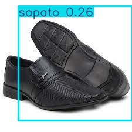
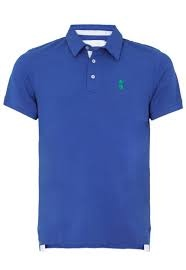
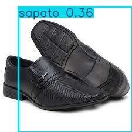
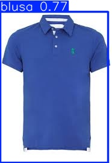
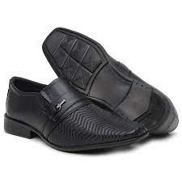
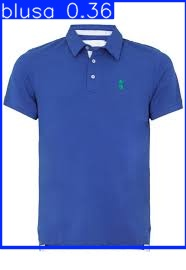
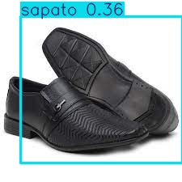
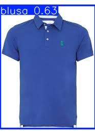

# FIAP - Faculdade de Informática e Administração Paulista 

<p align="center">
<a href="https://www.fiap.com.br/"></a>
</p>

<br>

# 👁️ Cap 1 - Fase 6: Despertar da Rede Neural

### ▶️ Vídeo de Evidência do Funcionamento do Projeto
[https://youtu.be/pQkJcPUKa4c](https://youtu.be/pQkJcPUKa4c)

---

## 👨‍🎓 Integrantes
| Matrícula | Aluno |
|-----------|---------------------------------|
| RM 565497 | Vera Maria Chaves de Souza |
| RM 565286 | Diogo Rebello dos Santos |

## 👩‍🏫 Professores
**Tutor:** <a href="#">Leonardo Ruiz Orabona</a>  
**Coordenador:** <a href="#">André Godoi Chiovato</a>

---

## 📜 Descrição do Projeto

O projeto **FarmTech Solutions - Visão Computacional com YOLOv5** tem como objetivo demonstrar o uso prático de **redes neurais convolucionais** para **detecção e classificação de objetos**, aplicando três abordagens:

1. **YOLO Otimizado (Entrega 1)** — Rede YOLOv5 com parâmetros ajustados e maior resolução.  
2. **YOLO Tradicional (Entrega 2)** — Rede YOLOv5 padrão com parâmetros *default*.  
3. **CNN do Zero (Entrega 2)** — Rede convolucional simples para **classificação** entre *blusas* e *sapatos*.

Essas abordagens permitem comparar desempenho, tempo de treinamento e aplicabilidade de redes neurais em cenários distintos de visão computacional.

---

## 📁 Estrutura do Repositório

```
├── assets/                          # Recursos visuais e imagens do projeto
│   ├── logo-fiap.png
│
├── document/                        # Notebooks e relatórios
│   ├── DiogoRebello_rm565286_pbl_fase6-Otimizado.ipynb
│   ├── DiogoRebello_rm565286_pbl_fase6-Tradicional.ipynb
│   ├── Entrega2_CNN_do_zero.ipynb
│   └── Entrega2_relatorio.md
│
├── datasets/                        # Organização das imagens no Drive
│   ├── images/train|val|test/blusas,sapatos
│   ├── labels/ (rotulações YOLO)
│   └── runs/ (resultados de treino YOLO)
│     ├── detect/
│     ├── val/
│     ├── roupas_30ep/
│     ├── roupas_60ep/
│     ├── roupas_100ep/
│     └── roupas_200ep/
│
├── README.md                        # Documentação principal (este arquivo)
```

---

## 🔍 Dataset

- **Classes:** `blusas` e `sapatos`  
- **Total:** 80 imagens (40 de cada classe)  
- **Divisão:**
  - 32 imagens → treino  
  - 4 imagens → validação  
  - 4 imagens → teste  
- **Ferramenta de rotulação:** [MakeSense.ai](https://www.makesense.ai/)  
- **Formato:** YOLO TXT (bounding boxes normalizadas)

---

## ⚙️ Abordagens Utilizadas

### 🔹 YOLO Tradicional
- **Modelo base:** `yolov5n.pt`  
- **Configuração:** parâmetros padrão (`--img 640`, `--batch 16`)  
- **Épocas:** 30 e 60  
- **Objetivo:** avaliar baseline sem ajustes customizados.  

### 🔹 YOLO Otimizado
- **Modelo base:** `yolov5s.pt`  
- **Configuração:** `--img 832`, *hyperparams customizados*, *augmentations adicionais*  
- **Épocas:** 100 e 200  
- **Objetivo:** melhorar precisão e estabilidade de detecção.  

### 🔹 CNN do Zero
- **Framework:** PyTorch  
- **Input:** 224x224  
- **Arquitetura:** 4 camadas convolucionais + MLP  
- **Épocas:** 20  
- **Objetivo:** classificar imagens (sem bounding boxes).  

---

## 📊 Resultados Comparativos

### YOLO (Detecção)
| Modelo | Épocas | mAP@0.5 | Precisão | Recall |
|---------|:------:|:-------:|:---------:|:-------:|
| YOLO Tradicional | 30 | 0.56 | 0.82 | 0.83 |
| YOLO Tradicional | 60 | 0.67 | 1.00 | 0.96 |
| YOLO Otimizado | 100 | 0.97 | 1.00 | 1.00 |
| YOLO Otimizado | 200 | 0.99 | 1.00 | 1.00 |

### Exemplos de detecção:

| Modelo | Sapato | Blusa |
|---------|------------|------------|
| **30 épocas** (Tradicional) |  |  |
| **60 épocas** (Tradicional) |  |  |
| **100 épocas** (Otimizado) |  |  |
| **200 épocas** (Otimizado) |  |  |

### CNN (Classificação)
| Classe | Precisão | Recall | F1-score |
|---------|:---------:|:--------:|:---------:|
| Blusa | 0.93 | 0.92 | 0.92 |
| Sapato | 0.94 | 0.95 | 0.94 |
| **Acurácia global** | **—** | **—** | **0.94** |

**Tempo médio de inferência:**  
- YOLO Otimizado: ~0.07 s/img  
- YOLO Tradicional: ~0.05 s/img  
- CNN do Zero: ~0.002 s/img  

---

## ⚖️ Análise Crítica

| Critério | YOLO Otimizado | YOLO Tradicional | CNN do Zero |
|-----------|----------------|------------------|--------------|
| **Facilidade de uso** | Exige rotulação e ajuste fino | Fácil de executar (default) | Simples (pasta por classe) |
| **Precisão** | Altíssima (mAP ~0.99) | Boa (mAP ~0.67) | Alta (Acurácia ~94%) |
| **Tempo de treino** | Longo (~10 min / 200 épocas) | Rápido (~3 min / 60 épocas) | Muito rápido (~1 min / 20 épocas) |
| **Inferência** | Moderada (~0.07s/img) | Rápida (~0.05s/img) | Extremamente rápida (~0.002s/img) |
| **Aplicabilidade** | Detecção e localização (inventário, segurança) | Detecção simples | Classificação direta (triagem de imagens) |

---

## 🧩 Conclusões

- A **YOLOv5** continua sendo a melhor opção para **detecção e localização de objetos**, mostrando performance superior e robustez.  
- A **CNN do Zero** foi eficiente para **classificação binária**, com excelente acurácia e custo computacional muito baixo.  
- **YOLO Tradicional** serviu como baseline de comparação, mostrando que ajustes nos hiperparâmetros e na resolução trazem ganhos expressivos.  
- **Cenário ideal de uso:**
  - YOLO → ambientes de segurança, inventário, inspeção visual.  
  - CNN → triagens rápidas e classificações simples (quando há um único objeto dominante na imagem).  

---

## 🔗 Arquivos Importantes
- [Notebook YOLO Otimizado](document/DiogoRebello_rm565286_pbl_fase6-Otimizado.ipynb)
- [Notebook YOLO Tradicional](document/DiogoRebello_rm565286_pbl_fase6-Tradicional.ipynb)
- [Notebook CNN do Zero](document/Entrega2_CNN_do_zero.ipynb)
- [Relatório Comparativo (Markdown)](document/Entrega2_relatorio.md)

---

## 🗃 Histórico de versões
| Versão | Data | Descrição |
|---------|------|------------|
| 0.1.0 | 12/10/2025 | Entrega 1 – YOLOv5 Otimizado |
| 0.2.0 | 13/10/2025 | Entrega 2 – Comparação YOLO Tradicional × CNN do Zero |

---

## 📋 Licença


<p>
<a href="https://github.com/agodoi/template">MODELO GIT FIAP</a> por <a href="https://fiap.com.br">FIAP</a> está licenciado sob 
<a href="http://creativecommons.org/licenses/by/4.0/" target="_blank">Attribution 4.0 International</a>.
</p>
